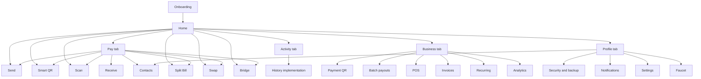

# T Pay UX and Information Architecture Audit

Date: 2026-07-13
Scope: Expo React Native app in `C:\Users\HLC\Downloads\t-pay`
Method: `tpay-wallet-ux-auditor` route inventory, source inspection, state inspection, and user-provided iPhone screenshots.

## 1. Product thesis and top three jobs

T Pay is a testnet-first social payment wallet for moving and coordinating Arc assets. It should make payment tasks obvious before exposing infrastructure, business tooling, or experimental features.

Top jobs:

1. Pay or receive an Arc Testnet asset safely.
2. Coordinate a request or split payment with minimal setup.
3. Verify what is pending, completed, or needs attention.

## 2. Current app map

The deterministic route inventory found 48 route files: 42 screens, 3 dynamic screens, and 3 layouts.

Observed aliases and hidden routes:

- `profile.tsx` re-exports `more.tsx`.
- `portfolio.tsx` re-exports `portfolio_v2.tsx`, which re-exports `history.tsx`.
- A tab-scoped Markets route re-exports the root Markets screen.
- Hidden tab screens include Earn, Markets, More, Portfolio V2, Recurring, Invoices, Settings, and Scan Tab.
- `/universal-pay` is registered in the root stack but no normal navigation entry references it.
- `/autoflow` has no normal navigation entry; `/insights` is reachable only from the hidden Earn screen.

## 3. Scorecard

| Dimension | Weight | Score | Weighted | Evidence | Confidence |
|---|---:|---:|---:|---|---|
| Product fit and top jobs | 15 | 4.0/5 | 12.0 | Home and tabs expose Pay, Request, Activity, and Business, but Split is secondary to Scan on Home. | High |
| Information architecture | 15 | 2.5/5 | 7.5 | Five tabs are appropriate, but Home/Pay duplicate actions and multiple routes represent the same concepts. | High |
| Core-flow friction | 15 | 3.5/5 | 10.5 | Send now uses owned-asset selection and review; Request/Receive/Smart QR/Split still overlap. | High |
| Transaction safety and trust | 15 | 4.5/5 | 13.5 | Send validates address, amount, balance, simulates, broadcasts once, waits for receipt, and records pending/failed/confirmed states. | High |
| State completeness | 10 | 3.5/5 | 7.0 | Send, FX, Bridge, Split, and Activity contain explicit states; Receive and Smart QR have thinner recovery behavior. | Medium |
| Mobile accessibility | 10 | 2.0/5 | 4.0 | Approx. 165 touch controls were found versus 1 explicit accessibility label and 4 explicit roles; touch sizes are generally reasonable. | Medium |
| Visual hierarchy | 8 | 3.0/5 | 4.8 | Balance is dominant, but seven actions precede payment state and glass decoration competes with content. | High |
| Design consistency | 5 | 3.0/5 | 3.0 | Shared tokens exist, but Card, LinearGradient, and LiquidGlassSurface are mixed with inconsistent labels and route names. | High |
| Motion and performance | 4 | 3.5/5 | 2.8 | Reanimated and Reduce Motion are used; sheen/blur is applied more broadly than needed. | Medium |
| Data and testnet honesty | 3 | 4.5/5 | 2.7 | Arc Testnet is explicit, balances are not fabricated, and failed balances use fallback states. | High |

**Total: 67.8 / 100**

Interpretation: the app is functional, but product hierarchy and consistency need a focused redesign before more cosmetic effects are added.

### Post-pass 1 provisional score

After applying the smallest coherent `Now` change set, the provisional score is **73.4 / 100**. Product fit, information architecture, core-flow friction, accessibility defaults, visual hierarchy, and motion improved. This remains provisional until the updated Home and Pay screens are inspected on physical iOS and Android devices.

## 4. Findings

### Medium: Home and Pay do not have distinct jobs

- Criterion: one canonical entry point per core task, with shortcuts only when their benefit is explicit.
- Evidence: Home defines Pay, Request, and Scan as primary actions and Split, Swap, Bridge, and Business as quick tools. Pay Hub repeats Pay, Request, Scan, Split, Receive, Contacts, Swap, and Bridge, plus another balance card.
- User impact: users cannot predict what the Pay tab adds beyond Home; the first screen becomes action-heavy and the second feels duplicated.
- Recommendation: keep Home as a status dashboard with Pay, Request, and Split as its three primary actions. Make Pay the task hub for Send, Request, Scan, Receive, Contacts, Swap, and Bridge. Remove the repeated large balance card from Pay and remove Business from Home because it already has a tab.
- Acceptance check: a new user can state the difference between Home and Pay after viewing each screen for three seconds.

### Medium: Request, Receive, Smart QR, and Split overlap

- Criterion: stable concepts and progressive disclosure.
- Evidence: `/smart-qr` exposes Request, Split Bill, and Wallet Profile modes while `/receive` and `/split-bill` are also dedicated routes.
- User impact: users must choose between multiple screens for the same outcome, and Split can be created in two places with different mental models.
- Recommendation: make Request the amount-based QR/link flow; provide `Receive without amount` as a secondary action; keep Split only in the dedicated Split Bill flow; keep reusable wallet QR under Profile or Receive.
- Acceptance check: one canonical path exists for Request, one for Receive, and one for Split; shortcuts resolve to those same screens.

### Medium: Core controls are not sufficiently labeled for assistive technology

- Criterion: icon-only controls require accessible names and controls require roles/states.
- Evidence: source scan found roughly 165 touch controls, 1 explicit `accessibilityLabel`, and 4 explicit `accessibilityRole` uses. Shared `Button` does not set a default role or state.
- User impact: VoiceOver/TalkBack users cannot reliably identify copy, settings, scan, close, asset, or transaction actions.
- Recommendation: give shared Button a default button role and accessibility state, add labels/hints to icon-only controls, and verify focus order on Home, Send, Receive, Split, Activity, and Business.
- Acceptance check: all core flows can be completed with VoiceOver or TalkBack without guessing icon meaning.

### Medium: Glass is used as a default card treatment rather than a hierarchy tool

- Criterion: glass belongs on floating navigation and controls; dense financial content should use calmer surfaces.
- Evidence: Home, Pay Hub, Business, and Profile use LiquidGlassSurface across most action tiles and tool rows. The user-provided Home screenshot shows highlight bands across multiple cards, drawing attention away from balances and states.
- User impact: visual noise makes the app feel decorative and heavier, while actions and payment status compete for attention.
- Recommendation: reserve glass for the tab bar, header controls, and one signature hero surface. Use quiet tonal surfaces for forms, balances, activity, and state cards. Remove animated sheen from repeated tiles.
- Acceptance check: money, payment state, and the next action are the three highest-contrast elements; repeated cards do not animate independently.

### Low: Route and label debt obscures the canonical architecture

- Criterion: one implementation name for one product concept.
- Evidence: Profile aliases More; Activity aliases Portfolio V2 then History; Markets has root and tab aliases; Universal Pay is registered but unreferenced.
- User impact: current users may not see a bug, but contributors can edit the wrong file or reintroduce a legacy route.
- Recommendation: keep compatibility redirects where needed, but rename canonical files incrementally and document or hide experimental routes. Do not delete routes until deep links and notifications are checked.
- Acceptance check: every visible tab has one canonical screen file and every retained alias has an explicit compatibility comment.

### Low: Pay Hub presents a USDC-only balance despite multi-asset support

- Criterion: product language and data model should agree across surfaces.
- Evidence: Pay Hub labels its balance `Available Arc USDC`, while Home, Send, Receive, and Profile support USDC, EURC, and cirBTC.
- User impact: users may infer that Pay only supports USDC even though Send selects owned assets.
- Recommendation: replace the large Pay balance hero with a compact wallet summary or owned-assets entry; let Send own asset selection.
- Acceptance check: Pay never implies USDC-only unless entering a USDC-only feature such as Split Bill.

## 5. Recommended app map and labels

```mermaid
flowchart TD
  H[Home: balance and payment state]
  P[Pay: move or request money]
  A[Activity: canonical history]
  B[Business: accept and manage payments]
  R[Profile: wallet and preferences]
  H --> HP[Pay]
  H --> HR[Request]
  H --> HS[Split]
  H --> HA[Active payments]
  H --> HL[Latest activity]
  P --> PS[Send]
  P --> PR[Request]
  P --> PSC[Scan]
  P --> PRE[Receive without amount]
  P --> PCT[Contacts]
  P --> PFX[Swap]
  P --> PBR[Bridge]
  B --> BQR[Payment request]
  B --> BPOS[POS]
  B --> BIN[Invoices]
  B --> BRP[Recurring]
  B --> BAN[Analytics]
  B --> BBP[Batch payouts]
  R --> RSEC[Security and backup]
  R --> RNT[Notifications]
  R --> RST[Settings]
  R --> RFA[Faucet]
  R --> RLAB[Experimental / developer]
```

Recommended labels:

- Home: `Pay`, `Request`, `Split` as primary actions; `Scan` as compact shortcut.
- Pay tab title: `Pay` or `Payments`; header copy should describe paying and requesting, not repeat infrastructure details.
- Business: use `Business` consistently because it contains POS, invoices, payouts, recurring, and analytics.
- Activity: one canonical label everywhere; keep `History` only as a compatibility route if required.
- Experimental: `Labs` or `Developer` under Settings/Profile, not a top-level destination.

## 6. Smallest coherent change set

### Now

1. Reorder Home primary actions to Pay, Request, Split.
2. Move Scan to a compact shortcut and remove Business from Home quick tools.
3. Remove the duplicate large balance hero from Pay Hub and make its purpose task-oriented.
4. Remove repeated sheen from action tiles; reserve glass for floating controls and navigation.
5. Add accessibility defaults to shared Button and labels to core icon controls.
6. Keep existing Send transaction logic unchanged.

### Next

1. Simplify Smart QR into Request plus Receive-without-amount.
2. Route all Split entry points to the dedicated Split Bill flow.
3. Make Activity the canonical source file and retain `/history` only as an explicit alias if deep links require it.
4. Add a shared screen-state component for loading, empty, offline, error, and retry.

### Later

1. Reintroduce Markets, Passport, Rewards, or automation only under a clearly labeled experimental area.
2. Test navigation labels with 5-8 target users before promoting experimental features.
3. Measure Home-to-payment completion time and abandonment instead of adding more dashboard cards.

### Remove or hide

- Hide `/universal-pay` until it replaces Send or has a distinct user job.
- Keep `/autoflow` and `/insights` out of normal navigation until their product role is defined.
- Do not delete compatibility routes until notification routes, QR links, and deep links are audited.

## 7. Implementation pass 1

- Home primary actions are now Pay, Request, and Split.
- Scan moved to the compact tools row; Business was removed from Home because it already has a stable bottom tab.
- Pay Hub no longer repeats a large USDC-only balance hero. It now explains that Send discovers assets with Arc Testnet balances.
- Repeated Home action sheen was removed while retaining restrained glass surfaces and press feedback.
- Shared Button now supplies a default button role, label, disabled state, and busy state.
- Core Home and Pay icon controls received explicit accessibility labels.
- Send transaction, asset discovery, signing, receipt, and activity logic were not changed.

## 8. Verification performed

- Ran deterministic Expo Router inventory: 48 route files.
- Inspected active tab layout, Home, Pay Hub, Send, Receive, Smart QR, Activity, Business, Profile, and transaction submission logic.
- Verified Send uses owned-asset discovery, review, one broadcast path, pending state, receipt confirmation, and failure recording.
- Counted interaction accessibility metadata across `app` and `components`.
- Inspected the two latest user-provided iPhone screenshots for Home and Send.
- `npm run type-check`: passed.
- `npm run lint`: passed with no warnings.
- `npm test`: 23 of 23 tests passed.
- `npx expo export --platform ios --clear`: passed; Metro emitted only known package-export fallback warnings for `@noble/hashes` and `rpc-websockets`.

## 9. Residual risks and assumptions

- The latest post-edit build has not yet been rendered side-by-side on a small iPhone and Android device.
- Screen-reader behavior has not been tested on a physical device.
- Some hidden routes may still be required by external QR links or notifications; route cleanup needs a deep-link audit first.
- Blur and sheen performance needs verification on a lower-end Android device.
- The supplied screenshots may predate the newest asset-picker implementation; code evidence was used for the current Send flow.
